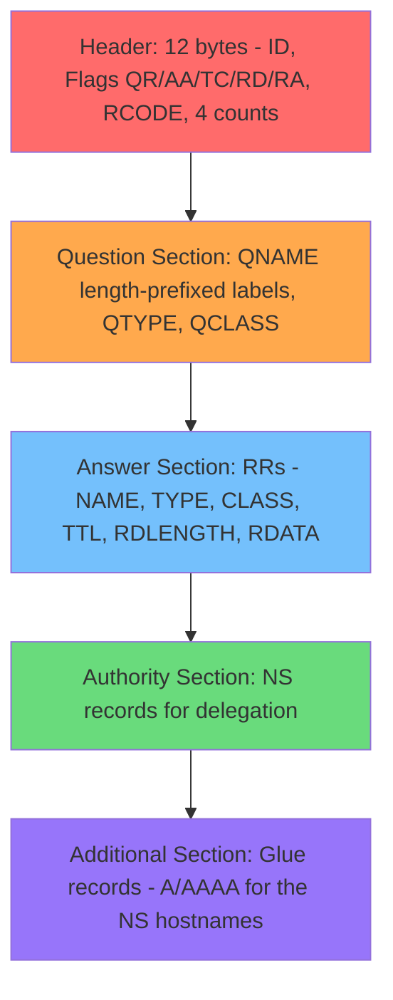
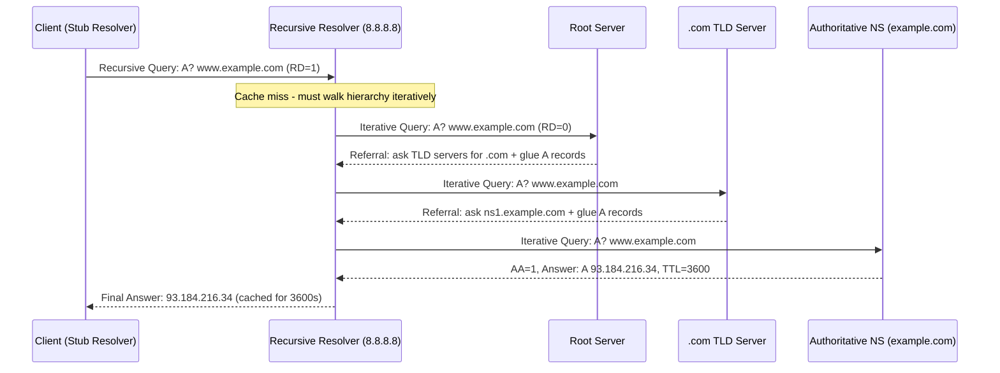
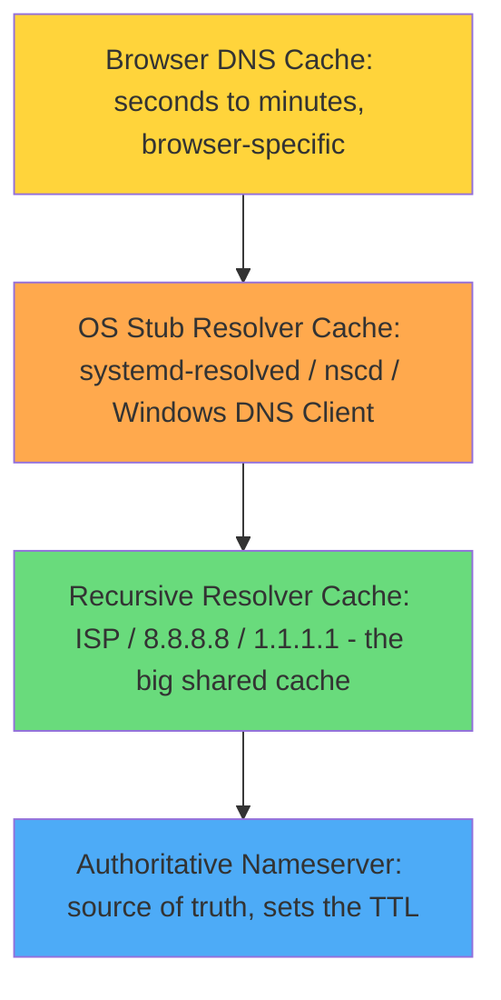
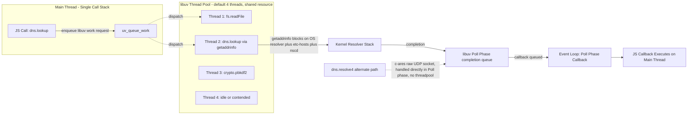
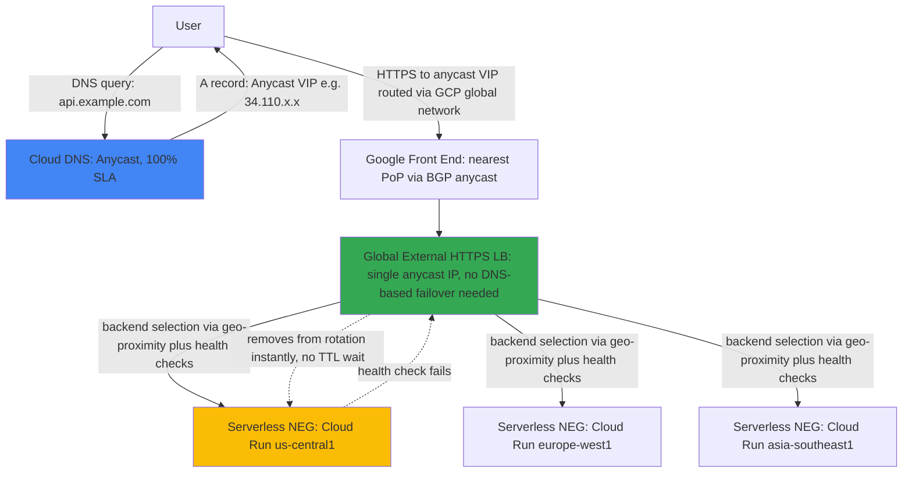

# Day 1: Domain Name System (DNS) — Basic to Maximum Depth

> Part of a Principal/Staff-level systems architecture study series.
> Source ordering reference: [system-design-primer](https://github.com/donnemartin/system-design-primer)

---

## 0. The Problem That Forces DNS to Exist

Computers route packets using **IP addresses** — fixed-length numeric identifiers
(`93.184.216.34` for IPv4, 32 bits; `2606:2800:21f:cb07:6820:80da:af6b:8b2c` for
IPv6, 128 bits). Humans cannot reliably memorize, type, or communicate these at
scale.

A second, less obvious reason DNS exists: **IP addresses are not stable
identifiers for a service.** A server can move data centers, get re-IP'd during
a migration, scale from 1 machine to 10,000, or get replaced after hardware
failure — the *service identity* (`example.com`) needs to be decoupled from the
*physical location* (the IP). DNS is, at its core, a **naming-to-location
indirection layer** — the same architectural pattern as a pointer in memory, or
a phone book mapping a name to a number that itself can be reassigned.

**Without DNS**, every client would need a hardcoded, manually distributed list
of name-to-IP mappings — which is exactly what existed before DNS: a single flat
file called `HOSTS.TXT`, manually maintained by Stanford Research Institute's
Network Information Center, downloaded by every machine on ARPANET via FTP.
This collapsed for three concrete, mechanical reasons:

1. **O(n) update propagation** — every new host required every other host to
   re-download the entire file.
2. **No hierarchy, no delegation** — one organization (SRI-NIC) was the sole
   authority for every name on the network. A single point of administrative
   and technical failure.
3. **No caching layer, no TTL concept** — the file was either fully current or
   fully stale; no notion of "good enough for the next hour."

DNS (RFC 882/883, 1983; refined in RFC 1034/1035, 1987) solves all three with:
**(1)** a hierarchical namespace with delegated authority, **(2)** a distributed
query protocol instead of a downloaded file, **(3)** caching with explicit
per-record expiry (TTL).

---

## 1. Architectural First Principles & Concrete Visual State

### 1.1 The Namespace Structure

A domain name is read **right to left** in terms of authority delegation, even
though humans read it left to right:

```
www.example.com.
 ^    ^      ^  ^
 |    |      |  +-- Root zone (trailing dot, almost always omitted by humans/
 |    |      |      browsers, but real — resolvers add it implicitly)
 |    |      +----- Top-Level Domain (TLD) — managed by a registry
 |    |             (e.g. Verisign for .com)
 |    +------------ Second-Level Domain — the part you register
 +----------------- Subdomain / hostname label — fully controlled by the
                    zone owner
```

Each segment is a **label**, max 63 octets; the full name is max 255 octets.
Not arbitrary — a direct consequence of the wire format using a single byte to
encode each label's length (a byte represents 0–255, with the high bits later
reserved for compression pointers, capping usable length at 63 — see 1.3).



Each dot represents a **zone boundary** — a point where administrative
authority can be delegated to a different organization running different
nameservers. `.com` is one zone (Verisign). `example.com` is a separate,
delegated zone (whoever owns that domain). This is the literal mechanism of the
hierarchy: **nested grants of authority**, recorded as an **NS (nameserver)
record** at the parent zone pointing to the child zone's nameservers.

### 1.2 Record Types

| Type | Purpose | Example |
|---|---|---|
| **A** | Hostname → IPv4 address | `example.com → 93.184.216.34` |
| **AAAA** | Hostname → IPv6 address | `example.com → 2606:2800:220:1:248:1893:25c8:1946` |
| **CNAME** | Alias: hostname → another hostname | `www.example.com → example.com` |
| **NS** | Delegates a zone to nameservers | `example.com → ns1.example.com` |
| **MX** | Mail routing, with priority | `example.com → 10 mail.example.com` |
| **TXT** | Arbitrary text — domain verification, SPF/DKIM | `"v=spf1 include:_spf.google.com ~all"` |
| **SOA** | Start of Authority — zone metadata: primary NS, serial, refresh/retry/expire timers | one per zone |
| **PTR** | Reverse lookup: IP → hostname | `34.216.184.93.in-addr.arpa → example.com` |

**Critical constraint:** a name with a **CNAME** record cannot have any other
record type at the same name (RFC 1034 §3.6.2). This is why you cannot put a
CNAME at the **zone apex** if that name also needs an MX or NS record — both
mandatory at a zone apex. This single constraint is *the entire reason* cloud
providers invented proprietary non-standard record types: AWS's **ALIAS**
record and Cloudflare/GCP's **CNAME flattening** — both resolve the alias
server-side at the authoritative nameserver, presenting the final A/AAAA record
to the client without violating CNAME-exclusivity.

### 1.3 The Wire Protocol

A DNS message (query or response) has this structure (RFC 1035 §4):

```
+---------------------+
|        Header        |  12 bytes fixed
+---------------------+
|       Question        |  the query: name, type, class
+---------------------+
|        Answer         |  RRs answering the question
+---------------------+
|       Authority        |  RRs pointing toward an authority
+---------------------+
|      Additional        |  RRs holding additional info (glue records)
+---------------------+
```

**Header fields:**

| Field | Bits | Meaning |
|---|---|---|
| ID | 16 | Matches query to response (also the basis of cache-poisoning attacks) |
| QR | 1 | 0 = query, 1 = response |
| Opcode | 4 | Standard query, inverse query, status |
| **AA** | 1 | Authoritative Answer — this server owns the zone |
| **TC** | 1 | Truncated — response didn't fit in UDP, retry over TCP |
| **RD** | 1 | Recursion Desired — client wants the full walk done for it |
| **RA** | 1 | Recursion Available — server supports doing that walk |
| RCODE | 4 | 0 = no error, 3 = NXDOMAIN, 2 = SERVFAIL |
| QDCOUNT/ANCOUNT/NSCOUNT/ARCOUNT | 16 each | Entry counts per section |

**Label encoding** is length-prefixed, not delimiter-based — the reason the
63-byte label limit exists. Each label is `[1-byte length][raw bytes]`,
terminated by a zero-length byte for the root. `www.example.com` becomes:
`0x03 'w' 'w' 'w' 0x07 'e' 'x' 'a' 'm' 'p' 'l' 'e' 0x03 'c' 'o' 'm' 0x00`. A
length byte can only express 0–63 because the **top two bits (0xC0)** are
reserved as a compression-pointer flag — if set, the rest is interpreted as an
offset back into the message where this name already appeared, avoiding
repetition across sections of the same packet. This is also a historical
attack surface (decompression bombs via self-referential pointers).

### 1.4 The Resolution Walk — Iterative vs Recursive

- **Recursive query**: client says "give me the final answer, do whatever
  lookups you need." Sent to your configured resolver (ISP, 8.8.8.8, 1.1.1.1).
- **Iterative query**: the resolver sends these to root → TLD → authoritative.
  Each gives a **referral**, not a final answer — "I don't know, but here's
  who might." The recursive resolver does the walking; root/TLD/authoritative
  servers never recurse on your behalf, by design — recursing would impose
  massive fan-out load on the 13 root server identities for the entire
  internet's query volume.

```
Client → Recursive Resolver: "A? www.example.com" (RD=1)
Recursive Resolver → Root:          "A? www.example.com" (RD=0)
Root → Recursive Resolver:          referral to .com TLD + glue A records
Recursive Resolver → TLD:           "A? www.example.com"
TLD → Recursive Resolver:           referral to ns1.example.com + glue
Recursive Resolver → Authoritative: "A? www.example.com"
Authoritative → Recursive Resolver: AA=1, Answer: A 93.184.216.34, TTL=3600
Recursive Resolver → Client:        93.184.216.34 (cached 3600s)
```



### 1.5 Caching — The Mechanism That Makes the System Survivable

Every record carries a **TTL**, in seconds, set by the zone owner. Every
resolver that touches that record — OS stub resolver, browser, recursive
resolver — caches it for that duration, **independently**, with **no
coordination between cache layers**.

This produces a non-obvious but interview-relevant property: **DNS has no
single global cache state.** Two clients querying the same name at the same
moment can get different answers depending on cache warmth. This is the literal
definition of eventual consistency — uniquely among most eventually-consistent
systems, bounded by a number you set yourself (the TTL), not an unpredictable
convergence process.

```
Browser DNS Cache (seconds-minutes, browser-specific)
  -> OS Stub Resolver Cache (systemd-resolved / nscd / Windows DNS Client)
    -> Recursive Resolver Cache (ISP / 8.8.8.8 / 1.1.1.1 - the big shared cache)
      -> Authoritative Nameserver (source of truth, sets the TTL)
```



Each layer is checked top to bottom before falling through, and each layer
honors its **own** cached TTL independently — the mechanism behind "why did
this take 6 minutes, not 30 seconds" production incidents (resolved in Section
6 below).

---

## 2. Deep Dive: Node.js Runtime & V8 Internals

### Why Node needs two separate DNS code paths

`getaddrinfo(3)` — the POSIX system call for hostname resolution — is
inherently synchronous/blocking at the OS level, with no async OS-native
equivalent on most platforms. Node's options: (a) block the main thread,
unacceptable for an event-loop runtime, or (b) push it to a worker thread —
`dns.lookup()`'s `uv_threadpool_t` path. Separately, Node ships a userspace DNS
protocol implementation (`c-ares`) to speak the wire protocol directly without
touching the OS resolver — `dns.resolve()`. Two paths exist because one solves
"don't block" and the other solves "full protocol control, bypass OS
caching/hosts-file quirks."

### `dns.lookup()` vs `dns.resolve()`

| Function | Execution Path | Mechanism |
|---|---|---|
| `dns.lookup(hostname)` | **libuv thread pool** | Calls native `getaddrinfo(3)`. Respects `/etc/nsswitch.conf`, `/etc/hosts`, local OS cache (`nscd`, `systemd-resolved`). |
| `dns.resolve()`, `dns.resolve4()`, `dns.resolve6()` | **Event loop, Poll phase, via `c-ares`** | Pure UDP/TCP DNS protocol implementation bundled in Node. Bypasses `/etc/hosts` entirely. No OS-level cache interaction. |

`dns.lookup()` is dispatched to the `uv_threadpool_t` — the same fixed-size pool
(default size 4, configurable via `UV_THREADPOOL_SIZE`, read once at startup)
that also handles `fs.*`, `crypto.pbkdf2`, `crypto.scrypt`, and `zlib`.



**Concrete failure mode:** with 4 threadpool slots, concurrent `fs.readFile()`
and `dns.lookup()` calls **contend for the same 4 threads.** A burst of
threadpool-bound file reads will starve DNS lookups, and vice versa — invisible
in profiling unless you specifically instrument `uv_threadpool` queue depth.

`dns.lookup()`'s callback re-enters the call stack as a **macrotask**,
processed in libuv's Poll phase once the threadpool signals completion — not
via `process.nextTick()` or the Promise microtask queue. There is no API to
cancel an in-flight `getaddrinfo()` call already dispatched to the OS.

```typescript
import dns from 'node:dns';
import { promisify } from 'node:util';

// PATH 1: Threadpool-bound, OS-resolver-aware, /etc/hosts honored
// Risk: contends with fs/crypto/zlib for the 4 default threadpool threads
const lookupAsync = promisify(dns.lookup);

async function resolveViaOS(hostname: string): Promise<string> {
  const { address } = await lookupAsync(hostname, { family: 4 });
  return address;
}

// PATH 2: c-ares direct protocol implementation, Poll-phase resident
// No threadpool contention. Bypasses /etc/hosts. Explicit resolvers required
// or it uses /etc/resolv.conf at startup.
const resolver = new dns.promises.Resolver();
resolver.setServers(['1.1.1.1', '8.8.8.8']);

async function resolveViaCares(hostname: string): Promise<string[]> {
  return await resolver.resolve4(hostname);
}

// PRODUCTION PATTERN: bound concurrency to avoid threadpool starvation
async function boundedResolve(
  hosts: string[],
  concurrency = 4,
): Promise<Map<string, string>> {
  const results = new Map<string, string>();
  const queue = [...hosts];

  async function worker() {
    while (queue.length > 0) {
      const host = queue.shift();
      if (!host) break;
      try {
        results.set(host, await lookupAsync(host));
      } catch (err) {
        results.set(host, `ERROR: ${(err as Error).message}`);
      }
    }
  }

  // Cap workers AT or BELOW UV_THREADPOOL_SIZE, else you're just creating
  // queue backpressure inside libuv instead of your own code, with worse
  // observability.
  await Promise.all(Array.from({ length: concurrency }, () => worker()));
  return results;
}
```

**Why `dns.resolve4()` is correct for high-throughput backend services:** it
never touches the threadpool, so it scales independently of `fs`/`crypto`
workload. Trade-off: you lose `/etc/hosts` overrides and OS-level `nscd`
caching. Node's `dns.resolve*()` does **not cache results between calls** at
all — every call is a fresh wire round trip unless you build a cache layer
yourself.

---

## 3. Deep Dive: Cloud-Native Architecture & GCP Implementation

### Why GCP needs its own DNS product

Authoritative nameserver latency and availability is itself a production
dependency. If your authoritative NS is slow or down, *every cache miss across
the planet* for your domain stalls or fails, for the full TTL window until you
fix it. Cloud DNS's value proposition is anycast-routed authoritative serving
with a 100% SLA — your zone's authoritative answer is served from whichever
Google edge location is topologically nearest the querying resolver — the same
physical principle as a CDN, applied to the DNS layer.

### Topology: Cloud DNS + Global External HTTPS Load Balancer

```
User --DNS query: api.example.com--> Cloud DNS (Anycast, 100% SLA)
Cloud DNS --A/AAAA: Anycast VIP e.g. 34.110.x.x--> User
User --HTTPS to anycast VIP, routed via GCP global network--> Google Front End
  (nearest PoP via BGP anycast)
GFE --> Global External HTTPS LB (single anycast IP, no DNS-based failover needed)
GLB --backend selection: geo-proximity + health checks--> Serverless NEG
  (Cloud Run us-central1 / europe-west1 / asia-southeast1)

Health check fails on a backend -> GLB removes it from rotation instantly,
no TTL wait involved.
```



**Key architectural insight:** GCP's Global External HTTPS Load Balancer uses
a **single anycast IP address globally**. DNS is removed from the failover
critical path. Failover does not depend on DNS TTL expiry (which would bound
failover time to the TTL window, plus resolver caching that may ignore your
TTL). Instead, failover happens at the **BGP/network routing layer and the load
balancer's health-check layer**, operating on the order of seconds, independent
of any client's DNS cache state.

```yaml
# Cloud DNS managed zone
# gcloud dns managed-zones create example-zone \
#   --dns-name="example.com." --description="prod zone"

# A record pointing to the Global LB's anycast IP (not regional)
# gcloud dns record-sets create api.example.com. \
#   --zone="example-zone" --type="A" --ttl="300" \
#   --rrdatas="34.110.x.x"
```

**Why TTL=300, not TTL=60:** lower TTLs increase query volume on your
authoritative layer proportionally, and increase median resolution latency
exposure for every cache-expired client. Since failover doesn't depend on DNS
TTL in this topology, there's no incentive to go lower — the anycast IP doesn't
change. The only reason to lower TTL aggressively is DNS-based traffic
steering (geolocation routing, weighted round-robin across regional IPs)
rather than anycast-based steering.

### Cold Start Interaction with DNS

Cloud Run scale-to-zero containers performing outbound DNS lookups on cold
start add to p99 cold-start latency:

1. Container cold start: ~200ms–2s
2. `getaddrinfo()` round trip if uncached: ~5–50ms within GCP's network,
   degrading to ~50–200ms for external domains with iterative lookups
3. TLS handshake to the resolved IP: ~50–100ms (1 RTT for TLS 1.3)

**Mitigation:** pin a connection pool with persistent keep-alive at module
scope so DNS resolution + connection establishment happens once per container
lifetime, not once per request:

```typescript
import { Agent } from 'undici';

// Module-level: survives across requests on a WARM container, rebuilt on
// every COLD start. This cost is amortized once per container lifetime.
const keepAliveAgent = new Agent({
  keepAliveTimeout: 30_000,
  keepAliveMaxTimeout: 60_000,
  connections: 10,
});

export async function handler(req: Request): Promise<Response> {
  const res = await fetch('https://downstream-api.example.com/data', {
    dispatcher: keepAliveAgent,
  });
  return new Response(await res.text());
}
```

**Cloud Run-specific knob:** set `--min-instances=1` (or higher) for
latency-sensitive services to eliminate scale-to-zero cold starts entirely, at
the cost of paying for idle compute — a cost-vs-tail-latency trade-off with no
free mitigation, only a choice of which metric absorbs the cost.

---

## 4. Failure Mechanics & The "Defensive" Filter

### Cascading Failures & Backpressure

**Failure mode: DNS resolver as an unbounded-latency single point of
contention.** A Node.js service issuing `dns.lookup()` per downstream
dependency normally resolves in 1–5ms (cached). If the upstream DNS resolver
degrades — regional network partition adding 200ms RTT to every iterative
query — trace the cascade:

1. Every `dns.lookup()` call blocks its libuv threadpool thread 200ms longer.
2. With default `UV_THREADPOOL_SIZE=4`, once 4 concurrent lookups are in
   flight, every subsequent `dns.lookup()`, `fs.readFile()`, and
   `crypto.pbkdf2()` call queues behind them — even operations with no
   relation to DNS.
3. If your service issues DNS lookups per-request, effective throughput
   collapses to `4 threads / 200ms = 20 req/s` for the entire
   threadpool-dependent workload.
4. **This is not visible in event loop lag metrics** — the event loop itself
   isn't blocked, just the threadpool. Dashboards showing "high latency, low
   CPU, normal event loop lag" frequently miss this because they don't
   instrument `uv_threadpool` saturation specifically.

### Little's Law Applied

`L = λ × W`

If arrival rate (λ) of threadpool-bound operations is 50 req/s, and per-task
wait time (W) balloons from 5ms to 205ms due to degraded DNS, the number of
in-flight items (L) the threadpool must hold balloons from
`50 × 0.005 = 0.25` to `50 × 0.205 = 10.25` — but only 4 threads exist. The
excess sits in **libuv's internal FIFO work queue**, growing unboundedly if λ
stays constant, because libuv's threadpool queue has **no max size and no
backpressure signal back to the application** — it accepts work indefinitely
and lets queue wait time grow. The symptom (latency) and the cause
(DNS-layer degradation, fully external) end up several abstraction layers
apart.

### CAP / PACELC Framing

DNS is firmly **AP** under CAP, and explicitly chooses **EL** (favor low
Latency over Consistency, even absent a partition) under PACELC. Even with zero
network partition, DNS resolvers serve stale cached answers in favor of
avoiding a round trip to the authoritative server — a deliberate, foundational
trade-off: DNS sacrifices read freshness unconditionally, as default behavior,
not just as a partition-tolerance fallback.

### Negative Caching

When a name genuinely doesn't exist, that absence is also cached (per the
**SOA record's minimum TTL field**, historically; modern practice uses RFC
2308's explicit negative-caching TTL). If you provision a new subdomain and a
resolver already cached an NXDOMAIN for it from before it existed, **clients
can fail to find your brand-new, correctly configured record until the
negative cache expires** — a distinct failure mode from stale-positive
caching, and one that catches teams doing blue-green cutovers or fast domain
provisioning off guard.

### Mitigation Strategies

| Pattern | Mechanism | Why It Applies to DNS |
|---|---|---|
| Application-level DNS caching with jittered TTL | Cache `dns.resolve4()` results yourself, respecting TTL with ±10% jitter | Node's c-ares path does zero caching; synchronized TTL expiry across many instances causes thundering-herd stampedes against your resolver |
| Circuit breaker on resolver failures | Track consecutive `ENOTFOUND`/`ETIMEDOUT`; trip after N failures, serve last-known-good IP from cache | DNS failures often correlate with broader network degradation; failing fast prevents threadpool queue buildup |
| Bounded concurrency on threadpool-dependent calls | Explicit work queue limiting concurrent `dns.lookup()` calls to ≤ `UV_THREADPOOL_SIZE` | Prevents your own code from starving the threadpool |
| `UV_THREADPOOL_SIZE` tuning | Raise from default 4 (e.g. 16–64) for threadpool-heavy workloads | Increases concurrent DNS+fs+crypto capacity, at the cost of more OS thread context-switch overhead — a real ceiling, not free scale-up |

---

## 5. Production Case Studies & Real-World Topologies

**Dyn DNS DDoS, October 2016.** A Mirai-botnet DDoS against Dyn (then a major
managed DNS provider) took down resolution for Twitter, Spotify, Reddit,
GitHub — not because those companies' application servers were attacked, but
because their authoritative DNS layer was a single externally dependent point
of failure. Lesson: use multiple, independent authoritative DNS providers
(secondary DNS across providers) so a provider-level outage doesn't zero out
discoverability even if your application servers are healthy. An SLA is a
financial remedy, not a physical guarantee against correlated failure modes
(BGP route leaks, registrar issues, DDoS).

**Facebook, October 2021.** A BGP configuration error during routine
maintenance withdrew the routes to Facebook's own authoritative DNS servers.
The DNS servers were technically fine but unreachable. Per their own internal
health-check design, the DNS servers **deliberately withdrew their own BGP
advertisements** when they detected they couldn't reach Facebook's internal
backbone — a safety mechanism meant to stop unreachable infrastructure from
announcing itself, which instead amplified the outage by removing the last
path to debugging it. Lesson: automated self-healing/circuit-breaking logic
needs to account for the case where its own corrective action removes the only
remaining path to manual recovery.

**Netflix's internal service discovery (Eureka, historically).** Moved away
from relying on DNS TTLs for internal service-to-service discovery, instead
using an application-layer registry with push-based updates and client-side
caching with explicit heartbeat-based invalidation — because DNS's TTL-bound
eventual consistency was too coarse-grained for the sub-second instance churn
rate of an autoscaling microservices fleet. Same principle as GCP's
anycast-LB-over-DNS pattern: when failover speed matters more than DNS's
caching model allows, move the dynamic routing decision below or above the DNS
layer, and let DNS resolve to a stable address that does the real routing.

---

## 6. Interview Lens — What Gets Asked, and What Separates Strong from Weak

### The 3 questions that come up constantly

**1. "Walk me through what happens when I type a URL into the browser."**
A breadth probe disguised as a basics question.

- *Weak:* "DNS resolves the domain to an IP, then the browser connects and
  downloads the page." Technically true, zero depth.
- *Strong:* Names the cache hierarchy (browser → OS → recursive resolver)
  unprompted, names the iterative walk (root → TLD → authoritative), mentions
  TCP vs UDP and when the TC flag forces TCP fallback, and connects DNS
  resolution time to the TLS and TCP handshakes that follow — treating DNS as
  one stage in a latency budget, not an isolated fact.

**2. "Why would you lower or raise a TTL, and what's the cost of each
direction?"**

- *Weak:* "Lower TTL means faster updates, higher TTL means more caching."
  Restates the definition, doesn't reason about cost.
- *Strong:* Lower TTL → more origin query volume (cost: load + billing) and
  more clients paying full resolution latency more often (cost: median
  latency, not just tail). Higher TTL → slower propagation of any change,
  including emergency ones (cost: incident remediation speed). The senior
  move: naming the specific runbook pattern of dropping TTL to 60s days before
  a planned cutover, doing the cutover, then raising it back after observing
  propagation.

**3. "DNS-based geolocation routing is sending some EU users to a US region.
Debug it, and architect around it long-term."**

- *Weak:* Checks DNS records, maybe mentions `dig`/`nslookup`, stays at
  configuration-inspection level.
- *Strong:* Separates the two steering models immediately: DNS-based
  geo-routing answers differently depending on the **querying resolver's**
  location (not the end client's — a frequently misunderstood gap, since a
  client using 8.8.8.8 routes through Google's resolver infrastructure, whose
  geography doesn't match the client) versus anycast-based steering, where the
  network layer itself routes to the nearest instance of a single global IP
  regardless of which resolver answered. Names the debugging gap: DNS
  resolution alone doesn't reveal which resolver geolocation database made the
  decision — you'd need EDNS Client Subnet (ECS) visibility or direct testing
  against the LB's anycast IP to isolate whether the bug is DNS-layer or
  network-layer.

### Resolving "why 6 minutes, not 30 seconds" (the TTL discrepancy)

A weak answer stops at "DNS caching is eventually consistent, maybe a cache
didn't expire." A strong answer enumerates the independent cache layers that
don't share a clock:

1. GKE pods' libc resolver may cache independently of `kube-dns`/`CoreDNS`
   depending on `nsswitch.conf` and `dnsPolicy` configuration.
2. `kube-dns`/`CoreDNS` caches with its own TTL floor/ceiling configuration —
   often clamped regardless of upstream TTL, a common Kubernetes-specific
   gotcha.
3. GKE nodes may run **NodeLocal DNSCache**, an additional caching layer
   between pods and `kube-dns`, frequently misconfigured to not pass through
   the authoritative TTL faithfully.
4. The upstream recursive resolver your cluster forwards to has its own cache,
   potentially with negative or positive TTL flooring/ceiling that doesn't
   match the third party's stated TTL.
5. Some resolvers clamp minimum TTLs upward (refusing anything below 60s or
   300s) as a defensive measure against TTL-based DDoS amplification or to
   reduce their own query load — implementation-specific, not RFC-mandated.

The fix isn't "lower the TTL further" — it's eliminating the layers you don't
control (move to anycast-based routing for parts needing fast failover) and
auditing/configuring the layers you do control (NodeLocal DNSCache TTL
behavior, CoreDNS cache plugin settings) rather than assuming the third
party's stated TTL governs your fleet's actual behavior.

---

## Senior Staff Verification — Scenario Questions

**Question 1:**
A Node.js fleet of 200 instances on GKE issues `dns.resolve4()` (not
`dns.lookup()`) against a third-party payment API ~50 times/second per
instance, no application-level caching. The provider's authoritative DNS TTL
is 30 seconds. At 14:32 UTC the provider performs a blue-green IP cutover. At
14:33 UTC you see a 40% increase in connection-timeout errors against the
*old* IP, persisting for ~6 minutes — far longer than the 30-second TTL
suggests. Walk through every layer (c-ares behavior, recursive resolver
behavior, GKE node resolver configuration, `kube-dns`/Cloud DNS resolver
caching at the node level) that could explain the 6-minute discrepancy, and
propose the specific architectural fix, including its trade-off.

**Question 2:**
Design the DNS and load-balancing topology for a global API across three GCP
regions (us-central1, europe-west1, asia-southeast1), where one region must
support strict read-after-write consistency for regulated traffic (financial
transactions) while the other two serve eventually-consistent read replicas.
Explain precisely how you'd route traffic to guarantee consistency-sensitive
requests land on the correct region deterministically, without relying on DNS
TTL expiry as your consistency-enforcement mechanism — and quantify, using
PACELC framing, the latency cost imposed on an asia-southeast1 client needing a
strongly consistent write.

**Question 3:**
`UV_THREADPOOL_SIZE` is set to the default of 4, running on a GCP
n2-standard-8 (8 vCPUs). Production traces show p99 latency spikes correlating
exactly with concurrent `fs.readFile()` calls (config hot-reloading) coinciding
with `dns.lookup()` calls (legacy code path, not yet migrated to
`dns.resolve()`). Using Little's Law, derive the relationship between
threadpool thread count, task arrival rate, and per-task service time that
explains the observed queueing, then propose and justify a specific
`UV_THREADPOOL_SIZE` value — explaining why simply maximizing this value is not
free, tying the answer to OS-level thread context-switch overhead and vCPU
contention.
